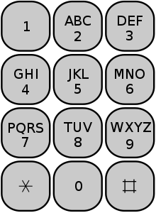

# Introduction

The Multi-tap code is a feature phone input technique used for creating SMS messages. It works by using the numeric keys 2 to 9 to select each letter of your text message. Each number key can represent up to four letters depending on how many times the key is pressed. The 0 (zero) key is used for a space, but it also has some special rules which will be explained.

For example: '2' for 'A', '22' for 'B', '222' for 'C', '3' for D, and so on 'COW' is written '2226669'. 

If a key is pressed more times than there are letters it can represent, the letter selection cycles back to the start. 

For example these 3 key press sequences, '2', '2222' and '2222222', all evaluate to the letter 'A'.


#### Special Rules for the 0 (Zero) key 
- If the message contains consecutive letters that are on the same numeric key, then the 0 key indicates the start of a new letter. For example "222028" = "CAT", the 0 marks the end of the first letter 'C' and start of the second letter 'A', no space is inserted. 
- If the next letter is not on the same numeric key then a 0 represents a space. For example "2036664" = "A DOG", A and D are on different keys so the 0 becomes a space.
- If the next letter is the same numeric key but there is a space in between then the 0 key is pressed twice. For example "200222028" = "A CAT", the double zero indicates the end of the first letter then a space.

#### Layout of the key pad on a Phone designed for multi-tap SMS messaging



\* <i> This may not be how multi-tap actually worked, but the stated rules should be followed for the purpose of this exercise. </i>

# The Coding Challenge

You must complete the Decode function in the KeyPressDecoder class. 

The function takes one string parameter, ```inputKeys```  representing key presses of a user, and returns a ```string ``` representing the decoded message.

There are unit test in the Tests project you can use to test that your code works correctly. You can create more tests if you want.

You can structure the code any way you would like. 


## Example inputs and expected output
| Input Keys | Expected Output |
| ---------- | --------------- |
| 023456789 | " ADGJMPTW" |
| 222028 | "CAT" |
| 200222028 | "A CAT" |
| 2222 | "A" |

## Suggested approach
Try and get a basic solution working, then enhance to handle special cases with zero keys.